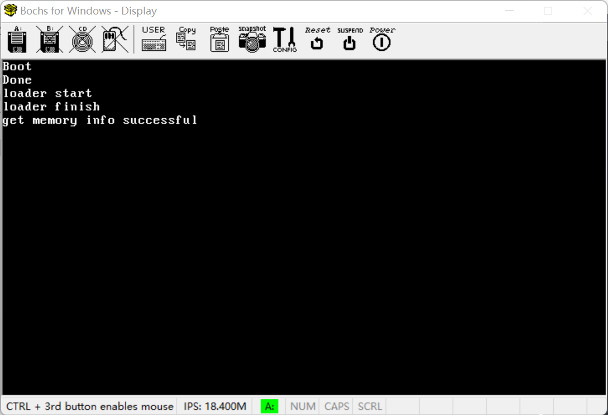
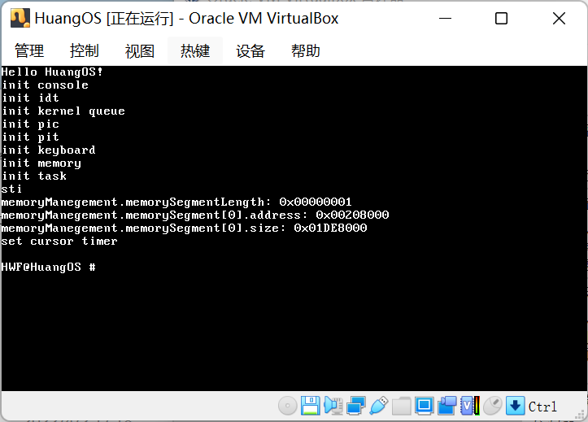

# A simple operating system #

The simple operating system is written by HuangWF and there are still bugs in the code. 

## tools ##
+ ubuntu 20.04.3 LTS
+ GNU make 4.2.1
+ NASM 2.14.02
+ GUN gcc 9.4.0 
+ GUN binutils 
+ bochs 2.6
+ Virtual Box 6.1.34

## images ##

